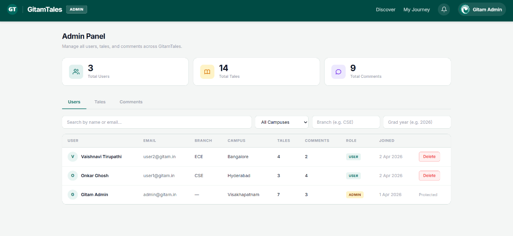
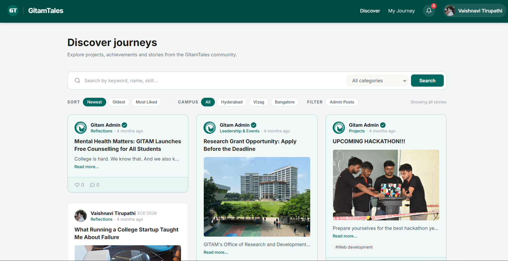
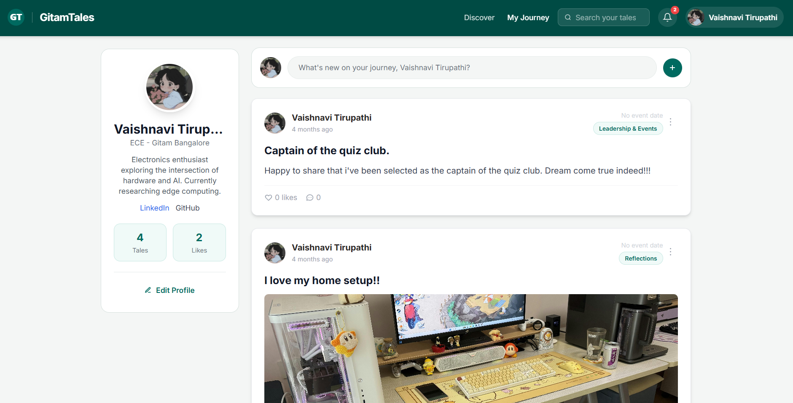
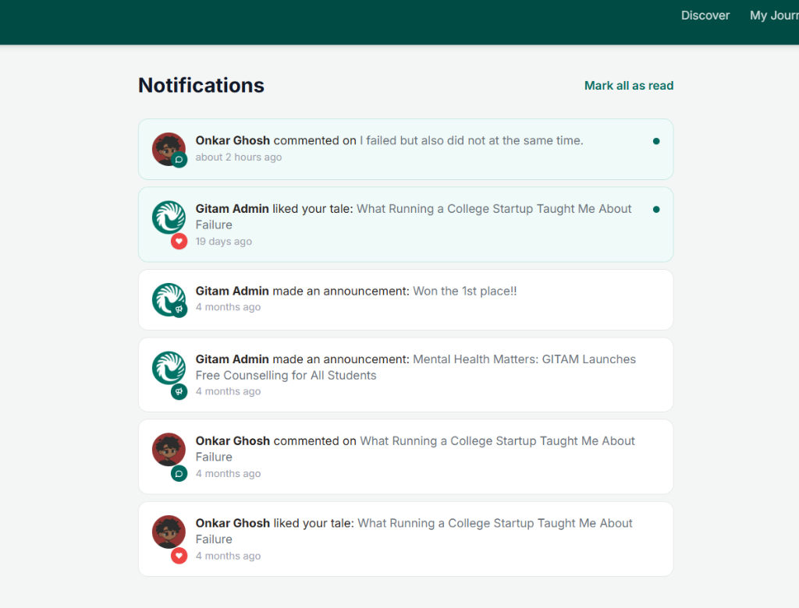
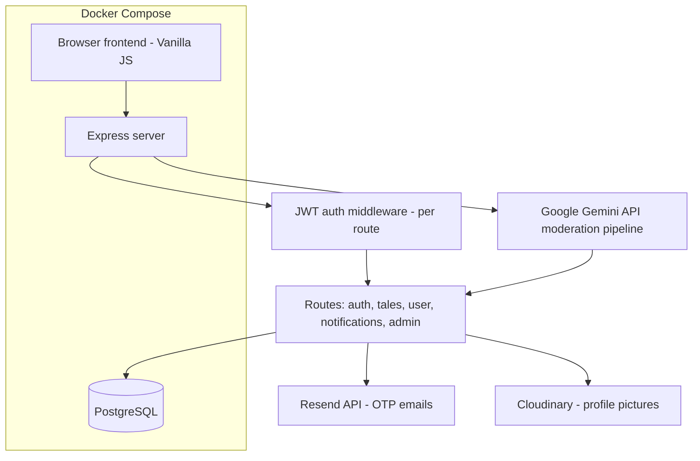

# GitamTales

A full-stack student story platform where users share and discover university experiences. Built with a vanilla JS frontend and a Node.js/Express backend, with AI-powered content moderation on every submission.


## Screenshots

| Admin Dashboard | Discover Journeys |
|---|---|
|  |  |
| **User Profile** | **Notifications** |
|  |  |

## Architecture



*Auth: JWT + bcrypt. No global middleware — each route file checks per-endpoint.*

## Features

**User**
- Sign up/login with JWT-based authentication
- Post, edit and delete personal stories ("tales")
- Browse and discover stories shared by other students
- In-app notifications for story activity
- Password reset link via Resend, token expires in 1 hour

**Content Moderation**
- Every submitted story is passed through the Google Gemini API before it's written to the database
- Flagged/toxic content is rejected or held for review instead of being published automatically

**Admin**
- Review and moderate reported or flagged stories
- Manage user accounts

**Security**
- JWT auth, bcrypt password hashing
- Password reset link via Resend, time-limited cryptographic tokens
- Anti-enumeration on forgot password to prevent email scanning
- Parameterised SQL to prevent injection
- Role-based route protection (user vs. admin)

## Tech stack

| Layer | Tech |
|---|---|
| Frontend | Vanilla HTML/CSS/JS |
| Backend | Node.js, Express 5 |
| DB | PostgreSQL |
| File storage | Cloudinary (profile pictures) |
| Auth | JWT, bcrypt |
| Email | Resend (Reset link) |
| Moderation | Groq SDK |
| Containerization | Docker Compose |
| CI/CD | GitHub Actions |

## Why Docker Compose, why Groq for moderation

- **Docker Compose**: frontend, backend and database run as separate services locally with one command (`docker-compose up --build`), keeping the dev environment identical across machines and closer to how it would be deployed.
- **Groq SDK for moderation**: story submissions are run through Groq's inference API before insertion, so toxic or policy-violating content is caught pre-publish rather than relying on manual review after the fact.
- **GitHub Actions**: installs dependencies on every push. Lint/build/test steps aren't wired up yet — see the # TODO in ci.yml.

## Project structure

```
GitamTales-main/
├── backend/          # Express API server
│   ├── routes/       # API route handlers (auth, admin, tales, user, etc.)
│   ├── utils/        # Utility functions (hash, token, moderator)
│   ├── uploads/      # User-uploaded files and media
│   └── server.js     # Backend entry point
├── css/               # Stylesheets for the web pages
├── js/                 # Frontend JavaScript logic (auth, dashboard, etc.)
├── assets/            # Static assets and images
├── docker-compose.yml
└── *.html             # Frontend pages (index, login, dashboard, signup, etc.)
```

## Database

*(Update to match your actual schema)*

**users** — id, name, email, password (bcrypt hash), role (user/admin), created_at, reset_token, reset_token_expires

**tales** — id, user_id (FK), title, content, status (published/flagged/rejected), moderation_score, created_at, updated_at

## API

*(Update to match your actual route handlers)*

**Auth** — `POST /api/auth/login`, `/signup`, `/forgot-password`, `/reset-password`

**Tales** — `GET /api/tales` (feed), `/api/tales/:id` · `POST /api/tales` submit (runs through moderation) · `PUT /api/tales/:id` edit · `DELETE /api/tales/:id`

**User** — `GET /api/user/me` · `PUT /api/user/:id`

**Admin** — `GET /api/admin/flagged` · `PATCH /api/admin/tales/:id/status` · `GET /api/admin/users`

## Running locally

### Quick start (Docker)

```bash
git clone <repo-url>
cd GitamTales-main
docker-compose up --build
```

Frontend: `http://localhost:8000` · Backend API: `http://localhost:5000`

### Manual setup (without Docker)

```bash
cd backend
npm install
```

`.env` in `backend/`:
```
DATABASE_URL=postgresql://...
JWT_SECRET=...
PORT=5000
RESEND_API_KEY=...
GROQ_API_KEY=...
FRONTEND_URL=http://localhost:8000
```

`npm start` for the backend. In a separate terminal at the project root: `python -m http.server 8000` or `npx serve .` for the frontend.


## License

MIT
